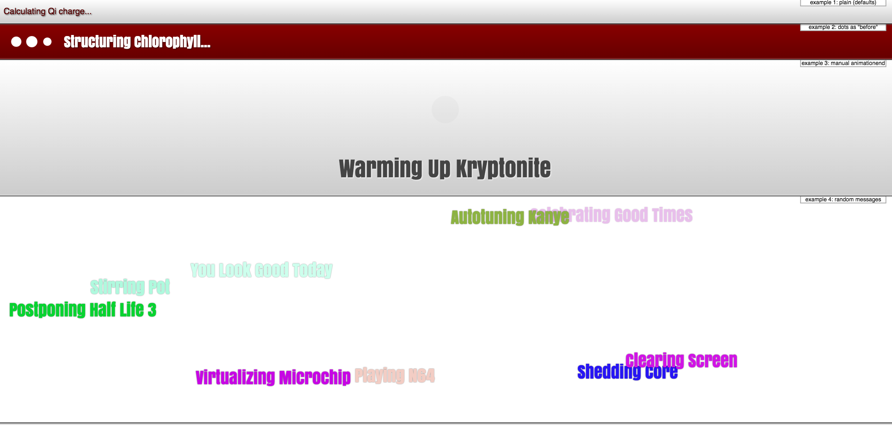

# loadr

Not just another spinner.

[](example/sshot.png)

It can auto rotate messages given an element or just return messages.

[](https://david-dm.org/DimitarChristoff/loadr)
[](https://david-dm.org/DimitarChristoff/loadr#info=devDependencies)


Works under ES6 or ES5

```javascript
var instance = new Loadr(document.querySelector('.loader');

instance.start();
// ...
instance.stop();
```

Change options

```javascript
var instance = new Loadr(document.querySelector('.loader', {
	delay: 2000,
	before: '<i class="fa fa-spin fa-pulse"></i> '
});
```
